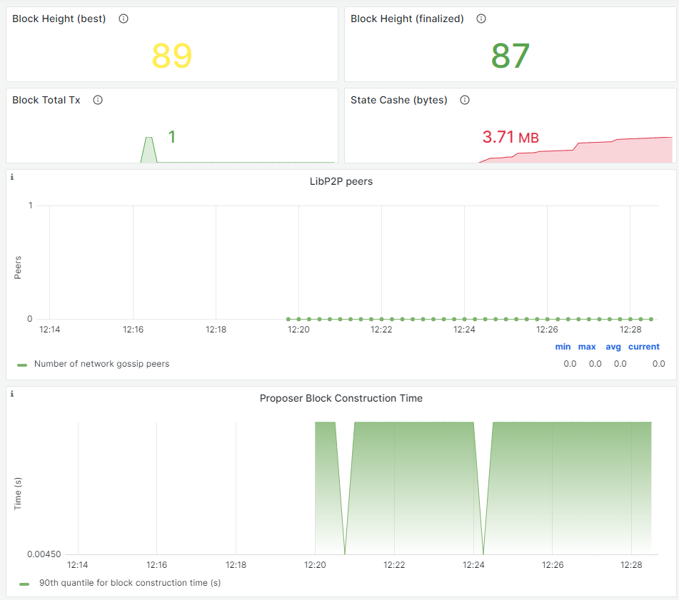

# TODO-List

[](LICENSE)


A full-stack development pet project experimenting with L1 Blockchain, smart contract and monitoring tools. 

Click [here](https://binglebangle-bh.github.io/TODO-List/)  to check out the static front UI

## Table of Contents

- [Quick Setup](#quick-setup)
- [Tech Stack](#tech-stack)
- [Usage](#usage)
- [Monitoring Node](#monitoring-node)
- [Troubleshoot](#troubleshoot)
- [License](#license)

## Quick Setup

The project can be quickly setup using docker commands
```
docker pull skyareblue/todolist:1.1
docker run -p 5000:5000 -p 8000:8000 -p 9090:9090 -p 9615:9615 --name mycontainer -d -t skyareblue/todolist:1.1
```

Once the docker is running, it will begin installing RUST and L1 blockchain.
Track the progress using this command
```
docker logs --follow <container id>
```

The setup is complete when the blockchain is running. 
It should look something like this in the log file.

```
2023-06-15 04:19:36 🙌 Starting consensus session on top of parent 0x6cb93ee7249965e53b541b3ae3a255a04e2ebf0bbd7e87ff463c94c253296ed7    
2023-06-15 04:19:36 🎁 Prepared block for proposing at 1 (0 ms) [hash: 0xe4d8d52b18bca68de05995fec85f23dbeb3e75931dc4f7ce339a19a9a47c251a; parent_hash: 0x6cb9…6ed7; extrinsics (1): [0x285f…0c7f]]    
2023-06-15 04:19:36 🔖 Pre-sealed block for proposal at 1. Hash now 0x073225490bca0309f1c03c6b3d4394f0354b483d5893fbd8a30bf9db5bcc9067, previously 0xe4d8d52b18bca68de05995fec85f23dbeb3e75931dc4f7ce339a19a9a47c251a.    
2023-06-15 04:19:36 ✨ Imported #1 (0x0732…9067)    
2023-06-15 04:19:40 💤 Idle (0 peers), best: #1 (0x0732…9067), finalized #0 (0x6cb9…6ed7), ⬇ 0 ⬆ 0    
```

## Tech Stack

- Programming Language: Python, Rust
- Web Framework: Python, Flask
- Database: Substrate
- Frontend: HTML, JS(Vanilla), 
- Deployment: Docker
- Monitoring: Grafana, Prometheus

## Usage

To access the frontend UI, go to localhost:8000.

3 template accounts and 4 existing tasks are created. You can use delete and modify by selecting the right accounts.

## Monitoring node



To monitor the node, you'll have to install grafana-server.

Run this set of command to install
```
sudo apt-get install -y adduser libfontconfig1
wget https://dl.grafana.com/enterprise/release/grafana-enterprise_10.0.0_amd64.deb
sudo dpkg -i grafana-enterprise_10.0.0_amd64.deb
```

Start grafana-server and check if it's up
```
sudo systemctl start grafana-server
sudo systemctl status grafana-server
```

Once installed, navigate to http://localhost:3000 and import a dashboard. 

Follow this [link](https://docs.substrate.io/tutorials/build-a-blockchain/monitor-node-metrics/#import-a-template-dashboard) to import a dashboard. 

You will have a web UI monitoring the substrate node.


## Troubleshoot

Bugs do occur where the page does not reload/refresh. Run it in incognito mode or simple restart the browser. That should do the trick.


## License

This project is licensed under the [MIT License](LICENSE).

